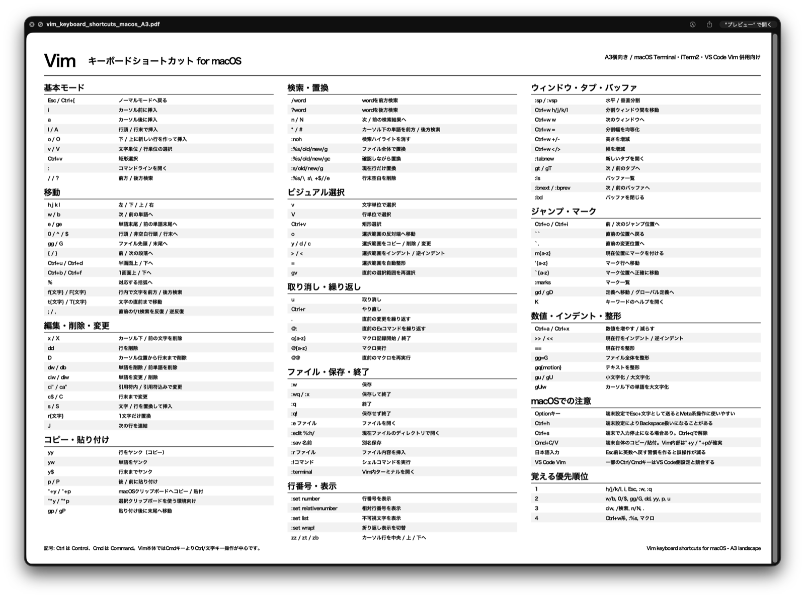

# Vim Keyboard Shortcuts for macOS

[日本語README / Japanese README](README.ja.md)

## Download

- Direct PDF download:
	https://raw.githubusercontent.com/omiya-bonsai/vim-shortcuts/main/vim_keyboard_shortcuts_macos_A3.pdf
- If GitHub shows "Unable to render", use the direct download link above.

A monochrome A3 landscape reference sheet for Vim / Neovim users on macOS.

## Preview

Designed for:

- macOS Terminal
- iTerm2
- VS Code Vim
- Neovim
- daily keyboard-driven workflows

This project focuses on:

- fast visual scanning
- practical everyday commands
- Vim grammar understanding (`d`, `c`, `y`, etc.)
- printable wall-reference usability

---

## Features

- A3 landscape layout
- monochrome print-friendly design
- Japanese-language content
- Vim motion / editing / search / window management references
- macOS-specific operational notes
- beginner-to-intermediate friendly

---

## Files

- `vim_keyboard_shortcuts_macos_A3.pdf`
- `images/vim_keyboard_shortcuts_macos_A3_preview.png`
- `README.md`
- `README.ja.md`
- `LICENSE`

---

## Notes

This project is an unofficial personal work.

The layout structure was inspired by the Visual Studio Code shortcut sheet style,
but all Vim-oriented contents were independently recreated and reorganized.

Visual Studio Code is a trademark of Microsoft.

---

## License

MIT License

Copyright (c) 2026 omiya-bonsai
